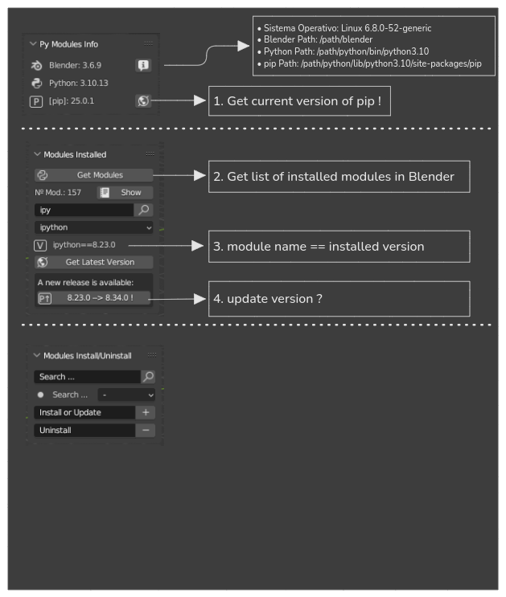

# WikiPythonmm
Documentation space where relevant information about the project is collected, organized, and shared.

## Windows
## Mac
## Linux

Blender installation methods:

| Methods  | Web                                          | Description                                                           |     |
| -------- | -------------------------------------------- | --------------------------------------------------------------------- | --- |
| Synaptic | [Synaptic](https://wiki.debian.org/Synaptic) | Graphical package manager                                             |     |
| apt      | [Apt](https://wiki.debian.org/Apt)           | Advanced Packaging Tool in terminal                                   |     |
| snap     | snapcraf.io                                  | Application with its dependencies. Supports updates. Signed packages. |     |
| flatpack | flathub.org                                  | Application without dependencies. Smaller size.                       |     |
| appimage | appimagehub.org                              | Portable application with dependencies. A single file.                |     |
