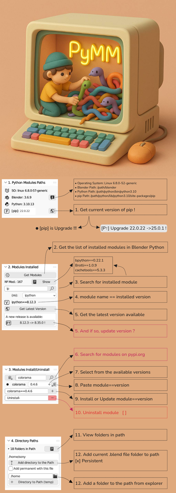
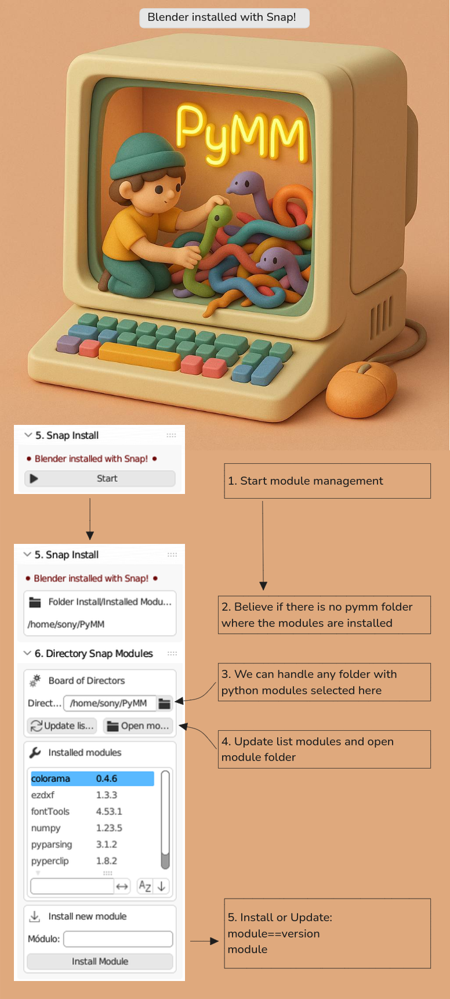

# WikiPyMM
Documentation space where relevant information about the project is collected, organized, and shared.<br>
## PyMM is here!

<br>
## PyMM Snap!

## Install blender cool in your system:
[docs.blender.org](https://docs.blender.org/manual/es/latest/getting_started/installing/index.html)
<br>
### Windows
### Mac
### Linux

## Blender installation methods:

| Methods                 | Web                                          | Description                                                           |     |
| ----------------------- | -------------------------------------------- | --------------------------------------------------------------------- | --- |
| [Synaptic](#synaptic)   | [Synaptic](https://wiki.debian.org/Synaptic) | Graphical package manager                                             |     |
| [Apt](#Apt)           | [Apt](https://wiki.debian.org/Apt)           | Advanced Packaging Tool in terminal                                   |     |
| [Snap](#Snap)         | [snapcraf.io](https://snapcraft.io/)         | Application with its dependencies. Supports updates. Signed packages. |     |
| [Flatpack](#Flatpack) | [flathub](https://flathub.org/)              | Application without dependencies. Smaller size.                       |     |
| [AppImage](#AppImage) | [appimagehub](https://www.appimagehub.com/)  | Portable application with dependencies. A single file.                |     |

---

### Synaptic
```bash TITLE:"Install Synaptic"
sudo apt update
sudo apt install synaptic
# running: synaptic
```
### Apt
```bash TITLE:"Check if apt is installed"
apt --version
# If you get a version number, `apt` is already installed.
```
On Debian-based system (ubuntu, ...), `apt` should already be installed by default, as it is the primary package manager for Debian-based distributions. However, if for some reason it is missing or broken, you can try the following steps to reinstall it:
#### 1. Reinstall apt
If `apt` is missing or not working, use `dpkg` (which is a lower-level package manager) to reinstall it:

```bash
sudo dpkg --configure -a
sudo apt update
sudo apt install --reinstall apt
```
. Let me know if you run into any issues! (---> Intro enlace mail, key_api)
#### 3. If apt is completely missing

If `apt` is completely broken or removed, you may need to install it manually:

```bash
sudo dpkg -i /var/cache/apt/archives/apt_*.deb
```

If that doesn’t work, download the latest `.deb` package for `apt` from:
[Debian's repository](https://packages.debian.org/search?keywords=apt) 
[Ubuntu's repository](https://packages.ubuntu.com/search?keywords=apt), 
and install it with:

```bash
sudo dpkg -i apt_*.deb
sudo apt install -f  # Fix dependencies
```
- Let me know if you run into any issues! (---> Intro enlace mail, key_api)
### Snap

|            |                                                                                                              |
| ---------- | ------------------------------------------------------------------------------------------------------------ |
| Snap       | A snap is a bundle of an app and its dependencies that works without modification across Linux distributions |
| Snapd      | Snapd is the background service that manages and maintains your snaps, automatically.                        |
| Snap Store | The Snap Store provides a place to upload snaps, and for users to browse and install the software they want. |
| Snapcraft  | Snapcraft is the command and the framework used to build and publish snaps.                                  |

To install `snap` on Debian-based system, follow these steps:
#### 1. Open a Terminal (`Ctrl + Alt + T`)
```bash
sudo apt update
sudo apt install snapd
```
#### 2. Enable the `snapd` service
After installation, make sure the `snapd` service is running:
```bash
sudo systemctl enable --now snapd
```
#### 3. Verify the installation
Check if `snap` is installed correctly by running:
```bash
snap --version
```
If it displays the `snap` version, the installation was successful.
#### 4. Restart (Optional)
If you experience issues after installing `snap`, restart your system:
```bash
sudo reboot
```

That's it! Now you can install packages with `snap`, for example:
```bash
sudo snap install vlc
```
- Let me know if you run into any issues! (---> Intro enlace mail, key_api)
### Flatpack
To install **Flatpak** on Debian-based system, follow these steps:
#### 1. Open a Terminal (`Ctrl + Alt + T`)
Run the following command to install **Flatpak**:
```bash
sudo apt update
sudo apt install flatpak
```

#### 2. Add the Flathub Repository (Recommended)
Flathub is the main source for Flatpak applications. To add it, run:
```bash
sudo flatpak remote-add --if-not-exists flathub https://flathub.org/repo/flathub.flatpakrepo
```

#### 3. Restart Your System (Optional)
To ensure Flatpak integrates properly, you can restart your system:
```bash
sudo reboot
```

#### 4. Verify the Installation
Check if Flatpak is installed correctly by running:
```bash
flatpak --version
```

#### 5. Install an Application (Example)
To test Flatpak, you can install an app like **VLC**:
```bash
flatpak install flathub org.videolan.VLC
```
- Let me know if you run into any issues! (---> Intro enlace mail, key_api)
### AppImage
On Debian-based system, you don’t need to install anything to run **AppImage** files, but some tools can improve integration.
### 1. Make the AppImage Executable
After downloading an `.AppImage` file, you need to make it executable. Open a terminal and run:
```bash
chmod +x FileName.AppImage
```

Then, run it with:
```bash
./FileName.AppImage
```

### 2. (Optional) Install AppImageLauncher
For better integration, you can install **AppImageLauncher**, which automatically manages AppImages.

```bash
sudo add-apt-repository ppa:appimagelauncher-team/stable
sudo apt update
sudo apt install appimagelauncher
```

After installation, every time you run an AppImage, it will integrate into the application menu automatically.
- Let me know if you run into any issues! (---> Intro enlace mail, key_api)

